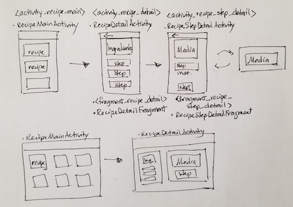

# Project 4 - Baking App

## What's Broken
- Back button from video screen results in NPE
- Detail screen (ingredients, steps) doesn't scroll (only Steps view scrolls)

## Design

## User Stories

## Required Features

## Optional Features

## Open-source libraries used

## Areas of learning
- Designing an app
- Using MediaPlayer/ExoPlayer to display videos
- Leverage a 3rd-party library
- Handling error cases in Android 
- Accessibility
- Localization
- Adding a widget
- Making an app production-ready
- Use Fragments to create a responsive design that works on phones and tablets.
- [Recipe JSON](https://d17h27t6h515a5.cloudfront.net/topher/2017/May/59121517_baking/baking.json)

## References/Acknowledgments
### Fragments
- [https://stackoverflow.com/questions/15313598/once-for-all-how-to-correctly-save-instance-state-of-fragments-in-back-stack]
### Homescreen Widgets
- [Developer Android/Build an App Widget](https://developer.android.com/guide/topics/appwidgets/)
- [Developer Android/Widget Design](https://developer.android.com/guide/practices/ui_guidelines/widget_design)
- [Lars Vogel Tutorial](http://www.vogella.com/tutorials/AndroidWidgets/article.html)
- [Berry Cupcake Icon](http://www.iconarchive.com/show/aka-acid-icons-by-archigraphs/Berry-Cupcake-icon.html)
### CardView
https://developer.android.com/reference/android/support/v7/widget/CardView

## Notes
